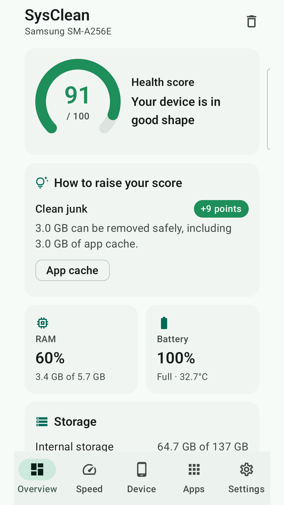
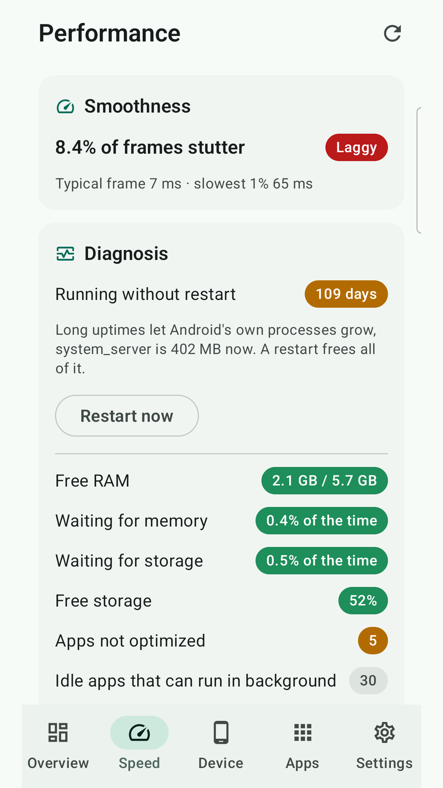
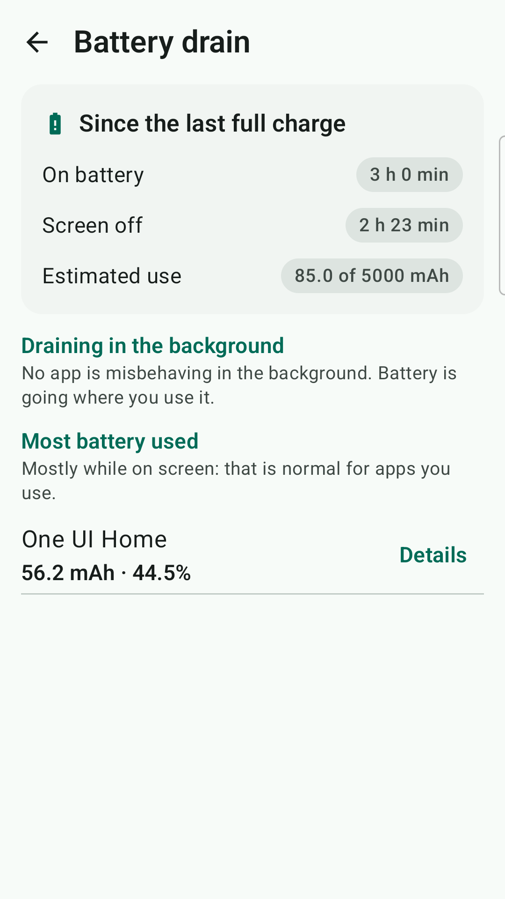
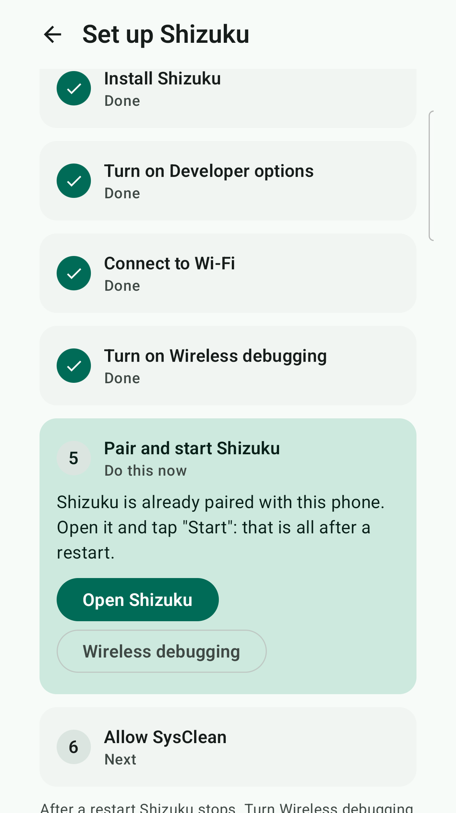

# SysClean

**English** · [Tiếng Việt](README.vi.md)

An Android phone cleaner that measures before it acts. SysClean scores your phone's health, cleans junk with a recycle bin, finds what drains the battery and frees RAM, and shows the result before and after. Everything runs on the device: the app has **no internet permission**, no ads, no analytics and no account.

<p>
  
  
  
  
</p>

- Version **0.7.1** · Android 8.0+ (minSdk 26, targetSdk 36)
- Works on every brand: Samsung, Xiaomi, OPPO, vivo, realme, OnePlus, Pixel, Transsion…
- English and Vietnamese (follows the system language, can be changed in Settings)
- Google Play: in closed testing · [Privacy policy](https://penz7.github.io/SysClean/privacy-policy.html)

## Features

### Health score and widget
- One score built from storage, junk, memory and battery, with the actions that would raise it.
- Home-screen widget (2×1, 2×2, 4×2) with the score, storage % and RAM %. It shares its data source with the app, so the numbers always match, and it updates live while the screen is on.

### Cleaning
- Finds app caches, temp/log files, thumbnails, APK installers, empty folders, leftovers of uninstalled apps, duplicate files, similar photos, blurry photos, large files (>100 MB), screenshots and old downloads (>90 days).
- **Recycle bin:** files are moved, not deleted, to `Android/media/vn.sysclean/trash` and can be restored to their original place. They are removed after 7, 14 or 30 days.
- **Safe defaults:** safe junk is preselected; similar photos, blurry photos, large files and screenshots are never preselected. Before a duplicate is removed, its full SHA-256 is compared with the copy that is kept, and at least one copy always remains.
- Undo after every clean, and an ignore list for files and folders you want to keep.

### Speed and battery
- **Diagnosis** of what really makes a phone slow: launcher jank, memory pressure (PSI), apps not compiled ahead of time, free storage, battery saver, always-on accessibility services, temperature, uptime.
- **One-tap optimisation:** compiles apps that need it, trims storage, frees memory held by closed apps, and can optionally put unused apps to deep sleep. The result is measured before and after ("RAM in use 64% → 56%"), not claimed.
- **RAM manager:** memory map per app; deep sleep for apps you don't use (undoable); turn off optional resident services; suggestions for pre-installed apps you haven't opened in 30+ days, on every brand.
- **Battery drain** since the last full charge: which apps wake the phone, hold wakelocks or run in the background while you never open them.

### Apps and device info
- App sizes, cache and last use; filter apps unused for 90+ days; uninstall the ones you don't need.
- Device details: CPU (live clock speeds), RAM/zRAM, battery, display, storage, sensors, cameras, security.

## Access modes

| Mode | What it adds |
|---|---|
| **Normal** (All files access + Usage access) | Scanning, cleaning, health score, widget, diagnosis |
| **Shizuku** (no root needed) | Cleaning `Android/data` and `obb`, per-app caches, force stop, batch uninstall, disabling pre-installed apps, one-tap optimisation, RAM manager, battery drain |
| **Root** | Same as Shizuku, plus clearing each app's internal cache. Off until you turn it on. Not yet verified on a real rooted phone |

**Setting up Shizuku:** Settings → *Set up step by step*. Six steps are ticked off automatically from the phone's real state, and each has a button that opens the right system screen. There are brand-specific notes for Xiaomi, OPPO/realme/OnePlus and Meizu. If Shizuku stops (usually after a reboot), the Overview shows a reminder.

**Never touched:** core system packages, the current launcher and keyboard, accessibility services, notification listeners, device admins, the default SMS and phone apps, always-on VPNs, SysClean and Shizuku.

## Privacy

- No `INTERNET` permission and no third-party SDKs; nothing leaves the phone.
- Every sensitive permission is explained in the app before it is requested.
- Full details: [privacy policy](https://penz7.github.io/SysClean/privacy-policy.html).

---

## For developers

**Stack:** Kotlin 2.2 · Jetpack Compose + Material 3 · Hilt · Room · DataStore · Glance · Navigation (type-safe routes) · Shizuku. Modularised the [Now in Android](https://github.com/android/nowinandroid) way, with convention plugins in `build-logic/`.

```
app/                      MainActivity, navigation, bottom bar
build-logic/convention/   Convention plugins (sysclean.android.*, sysclean.hilt, …)
core/
  model/                  Plain Kotlin data classes
  domain/                 Health score formula (shared by app and widget)
  common/                 Dispatchers, ApplicationScope, size/frequency formatting
  designsystem/           M3 theme, tokens, shared components
  ui/                     Localised labels for models
  privilege/              Permissions, Shizuku user service (AIDL), root; declares every permission
  database/               Room: recycle bin, ignore list, photo signature cache
  data/                   System info, recycle bin, preferences, apps
  scanner/                StorageWalker + PhotoAnalyzer (detection only)
  cleaner/                Cleaning, duplicate verification, undo
  performance/            Diagnosis, optimiser, RAM manager, battery stats parser
feature/
  dashboard/ deviceinfo/ apps/ settings/ cleaner/ trash/ widget/ performance/
fixture/                  Empty app used only by tests (deep sleep / disable)
docs/                     GitHub Pages site, privacy policy, Google Play kit (docs/play/)
```

A `feature` module never depends on another `feature`; navigation between screens goes through `app`.

### Notes on the privileged layer
- Commands are plain AOSP (`pm`, `am`, `cmd`, `dumpsys`, `sm`), so they behave the same on every brand.
- `PrivilegedPaths` (unit-tested) is the service's guard rail. It only deletes inside `Android/data`/`obb`, never the roots themselves, and rejects `..` and `//`. It only runs `pm`, `am`, `cmd`, `id` and `dumpsys batterystats --checkin` (never `--reset`).
- Root commands go through `RootCommands`, which escapes arguments and only *empties* `/data/(data|user|user_de)/<pkg>/(cache|code_cache)`.
- Similar photos use a 64-bit dHash (Hamming distance ≤ 4, taken ≤ 30 min apart). Blurry photos use Laplacian variance < 60 with contrast ≥ 20. Both are cached in Room.
- Battery drain parses `dumpsys batterystats --checkin`, which uses AOSP's stable CSV format. The parser is tested against a real dump.

### Build

```bash
./gradlew assembleDebug          # app/build/outputs/apk/debug/app-debug.apk
./gradlew assembleRelease        # R8-shrunk APK (~3 MB)
./gradlew bundleRelease          # AAB for Google Play
./gradlew testDebugUnitTest      # unit tests
```

**Release signing:** create `keystore.properties` in the project root. The keystore lives in `keystore/`. Both are in `.gitignore` and must never be committed.

```properties
storeFile=keystore/sysclean-release.jks
storePassword=...
keyAlias=sysclean
keyPassword=...
```

Without this file, release builds are unsigned. Debug and release share the application id `vn.sysclean` but use different keys, so uninstall one before installing the other. Back up the keystore: without it, no update can be installed over an existing release.

### Device tests

Install the app and the test APK, then run the tests with `am instrument`. Don't use `connectedDebugAndroidTest`: it uninstalls the app afterwards, which wipes its permissions, widget and recycle bin.

```bash
./gradlew :app:installDebug :app:installDebugAndroidTest
adb shell appops set --uid vn.sysclean MANAGE_EXTERNAL_STORAGE allow
adb shell appops set vn.sysclean GET_USAGE_STATS allow
adb shell am instrument -w -e class vn.sysclean.SmokeTest vn.sysclean.test/androidx.test.runner.AndroidJUnitRunner
```

| Test | What it does |
|---|---|
| `SmokeTest` | Visits every screen and runs a real scan (read-only) |
| `CleaningFlowTest` | Creates sample files in `Download/SysCleanFixture`, then clean → undo → clean → ignore → restore / delete. Deselects everything first, so real files are never touched |
| `PrivilegedFlowTest` | Needs Shizuku (skipped otherwise): leftover folders, own cache, force stop, uninstall and restore |
| `PerformanceFlowTest` | Needs Shizuku: diagnosis, one-tap TRIM, deep sleep and wake of the fixture app; restores the animation scale afterwards |
| `RootModeTest` | Turning on root mode on an unrooted phone fails cleanly |

On Xiaomi/MIUI, confirm "Install via USB" when asked, and allow background activity starts with `adb shell appops set vn.sysclean 10021 allow`.
