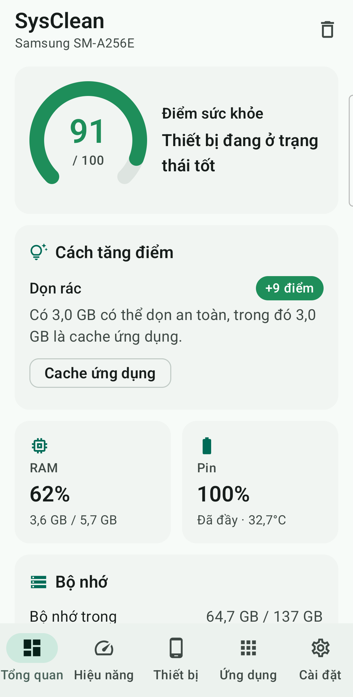
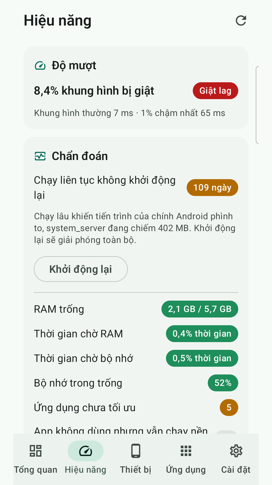
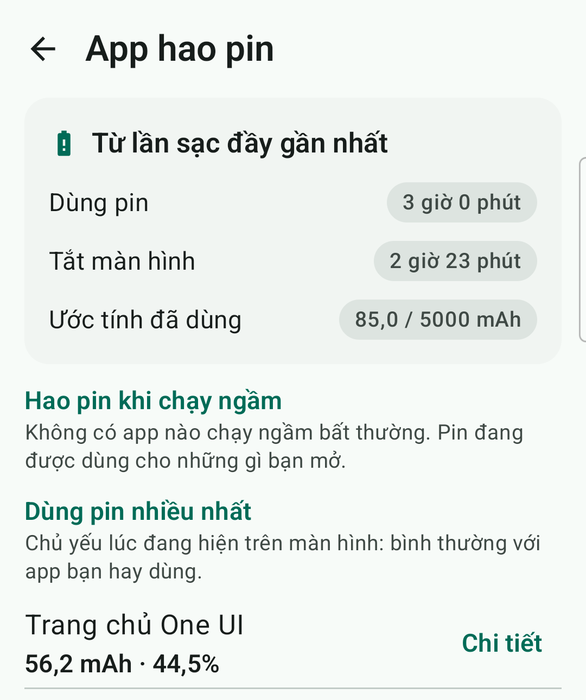
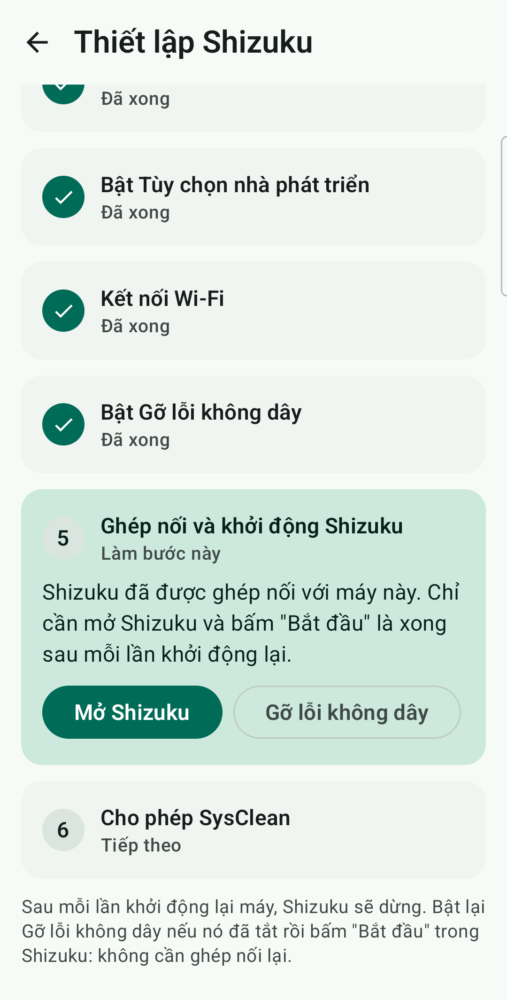

# SysClean

[English](README.md) · **Tiếng Việt**

Ứng dụng dọn dẹp điện thoại Android, đo trước khi làm. SysClean chấm điểm sức khỏe máy, dọn file rác có thùng rác, tìm app hao pin, giải phóng RAM, và cho xem kết quả trước và sau. Mọi thứ chạy ngay trên máy: ứng dụng **không có quyền Internet**, không quảng cáo, không phân tích, không tài khoản.

<p>
  
  
  
  
</p>

- Phiên bản **0.7.1** · Android 8.0 trở lên (minSdk 26, targetSdk 36)
- Chạy trên mọi hãng: Samsung, Xiaomi, OPPO, vivo, realme, OnePlus, Pixel, Transsion…
- Tiếng Việt và tiếng Anh (theo ngôn ngữ hệ thống, đổi được trong Cài đặt)
- Google Play: đang thử nghiệm kín · [Chính sách quyền riêng tư](https://penz7.github.io/SysClean/privacy-policy.html#vi)

## Tính năng

### Điểm sức khỏe và widget
- Một điểm số tổng hợp từ bộ nhớ, file rác, RAM và pin, kèm những việc cần làm để tăng điểm.
- Widget màn hình chính (2×1, 2×2, 4×2) hiển thị điểm, % bộ nhớ và % RAM. Widget dùng chung nguồn dữ liệu với app nên số liệu luôn khớp, và tự cập nhật khi màn hình bật.

### Dọn dẹp
- Tìm bộ nhớ đệm của app, file tạm/log, ảnh thu nhỏ, file APK, thư mục trống, phần sót lại của app đã gỡ, file trùng, ảnh giống nhau, ảnh mờ, file lớn (>100 MB), ảnh chụp màn hình và file tải về cũ (>90 ngày).
- **Thùng rác:** file được di chuyển chứ không xóa, vào `Android/media/vn.sysclean/trash`, khôi phục được về đúng chỗ cũ. File tự xóa sau 7, 14 hoặc 30 ngày.
- **Chọn sẵn an toàn:** rác an toàn được chọn sẵn; ảnh giống nhau, ảnh mờ, file lớn và ảnh chụp màn hình không bao giờ được chọn sẵn. Trước khi xóa một bản trùng, app so SHA-256 toàn bộ nội dung với bản giữ lại, và luôn giữ ít nhất một bản.
- Hoàn tác sau mỗi lần dọn, và danh sách bỏ qua cho file và thư mục muốn giữ.

### Tốc độ và pin
- **Chẩn đoán** nguyên nhân thật khiến máy chậm: độ giật của launcher, áp lực bộ nhớ (PSI), app chưa được biên dịch sẵn, bộ nhớ trống, tiết kiệm pin, dịch vụ trợ năng chạy thường trực, nhiệt độ, thời gian chạy liên tục.
- **Tối ưu một chạm:** biên dịch app cần thiết, TRIM bộ nhớ, giải phóng RAM của app đã đóng, và có thể cho app không dùng ngủ sâu. Kết quả được đo trước và sau ("RAM đang dùng 64% → 56%"), không hứa suông.
- **Quản lý RAM:** bản đồ RAM theo từng app; cho app không dùng ngủ sâu (hoàn tác được); tắt dịch vụ thường trực tùy chọn; gợi ý app cài sẵn đã hơn 30 ngày không mở, trên mọi hãng.
- **App hao pin** từ lần sạc đầy gần nhất: app nào đánh thức máy, giữ máy thức hoặc chạy ngầm dù bạn không mở.

### Ứng dụng và thông tin máy
- Dung lượng app, bộ nhớ đệm, lần dùng cuối; lọc app không dùng 90+ ngày; gỡ những app không cần.
- Thông tin máy: CPU (xung nhịp trực tiếp), RAM/zRAM, pin, màn hình, lưu trữ, cảm biến, camera, bảo mật.

## Chế độ quyền

| Chế độ | Thêm được gì |
|---|---|
| **Thường** (Truy cập mọi tệp + Truy cập dữ liệu sử dụng) | Quét, dọn, điểm sức khỏe, widget, chẩn đoán |
| **Shizuku** (không cần root) | Dọn `Android/data` và `obb`, bộ nhớ đệm từng app, buộc dừng, gỡ hàng loạt, tắt app cài sẵn, tối ưu một chạm, quản lý RAM, app hao pin |
| **Root** | Như Shizuku, thêm xóa bộ nhớ đệm nội bộ của từng app. Chỉ hoạt động khi bạn tự bật. Chưa kiểm chứng trên máy root thật |

**Thiết lập Shizuku:** Cài đặt → *Thiết lập từng bước*. Sáu bước được tự đánh dấu theo trạng thái thật của máy, mỗi bước có nút mở đúng màn hình hệ thống. Có hướng dẫn riêng cho Xiaomi, OPPO/realme/OnePlus và Meizu. Khi Shizuku dừng (thường do khởi động lại máy), màn Tổng quan sẽ nhắc.

**Không bao giờ đụng tới:** gói hệ thống lõi, launcher và bàn phím đang dùng, dịch vụ trợ năng, app đọc thông báo, quản trị thiết bị, app SMS và điện thoại mặc định, VPN luôn bật, SysClean và Shizuku.

## Quyền riêng tư

- Không có quyền `INTERNET`, không SDK bên thứ ba; không có gì rời khỏi điện thoại.
- Mỗi quyền nhạy cảm đều được giải thích trong app trước khi xin.
- Chi tiết: [chính sách quyền riêng tư](https://penz7.github.io/SysClean/privacy-policy.html#vi).

---

## Dành cho nhà phát triển

**Công nghệ:** Kotlin 2.2 · Jetpack Compose + Material 3 · Hilt · Room · DataStore · Glance · Navigation (route type-safe) · Shizuku. Chia module theo kiểu [Now in Android](https://github.com/android/nowinandroid), convention plugin nằm trong `build-logic/`.

```
app/                      MainActivity, điều hướng, thanh dưới
build-logic/convention/   Convention plugin (sysclean.android.*, sysclean.hilt, …)
core/
  model/                  Data class thuần Kotlin
  domain/                 Công thức điểm sức khỏe (dùng chung app và widget)
  common/                 Dispatcher, ApplicationScope, định dạng dung lượng/tần số
  designsystem/           Theme M3, token, component dùng chung
  ui/                     Nhãn song ngữ cho model
  privilege/              Quyền, user service Shizuku (AIDL), root; khai báo toàn bộ permission
  database/               Room: thùng rác, danh sách bỏ qua, cache chữ ký ảnh
  data/                   Thông tin hệ thống, thùng rác, tùy chọn, ứng dụng
  scanner/                StorageWalker + PhotoAnalyzer (chỉ phát hiện)
  cleaner/                Dọn dẹp, xác minh file trùng, hoàn tác
  performance/            Chẩn đoán, tối ưu, quản lý RAM, parser thống kê pin
feature/
  dashboard/ deviceinfo/ apps/ settings/ cleaner/ trash/ widget/ performance/
fixture/                  App rỗng chỉ dùng cho test (ngủ sâu / tắt)
docs/                     Trang GitHub Pages, chính sách quyền riêng tư, hồ sơ Google Play (docs/play/)
```

Module `feature` không phụ thuộc `feature` khác; điều hướng giữa các màn hình đi qua `app`.

### Về lớp đặc quyền
- Lệnh đều là AOSP thuần (`pm`, `am`, `cmd`, `dumpsys`, `sm`) nên chạy như nhau trên mọi hãng.
- `PrivilegedPaths` (có unit test) là hàng rào an toàn của service. Nó chỉ xóa bên trong `Android/data`/`obb`, không bao giờ xóa chính hai thư mục gốc, và chặn `..` cùng `//`. Nó chỉ chạy `pm`, `am`, `cmd`, `id` và `dumpsys batterystats --checkin` (không bao giờ `--reset`).
- Lệnh root đi qua `RootCommands`: escape tham số, và chỉ *làm rỗng* `/data/(data|user|user_de)/<pkg>/(cache|code_cache)`.
- Ảnh giống nhau dùng dHash 64-bit (khoảng cách Hamming ≤ 4, chụp cách nhau ≤ 30 phút). Ảnh mờ dùng phương sai Laplacian < 60 với độ tương phản ≥ 20. Cả hai được cache trong Room.
- App hao pin đọc `dumpsys batterystats --checkin`, là định dạng CSV ổn định của AOSP. Parser được test trên dump thật.

### Build

```bash
./gradlew assembleDebug          # app/build/outputs/apk/debug/app-debug.apk
./gradlew assembleRelease        # APK đã rút gọn bằng R8 (~3 MB)
./gradlew bundleRelease          # AAB cho Google Play
./gradlew testDebugUnitTest      # unit test
```

**Ký bản release:** tạo `keystore.properties` ở thư mục gốc dự án. Keystore nằm trong `keystore/`. Cả hai đều có trong `.gitignore` và không bao giờ được commit.

```properties
storeFile=keystore/sysclean-release.jks
storePassword=...
keyAlias=sysclean
keyPassword=...
```

Không có file này thì bản release không được ký. Bản debug và release cùng application id `vn.sysclean` nhưng khác khóa, nên phải gỡ bản này trước khi cài bản kia. Hãy sao lưu keystore: mất keystore thì không cài được bản cập nhật đè lên bản release đang có.

### Test trên máy thật

Cài app và APK test, rồi chạy bằng `am instrument`. Không dùng `connectedDebugAndroidTest`: lệnh này gỡ app sau khi chạy xong, làm mất quyền đã cấp, widget và thùng rác.

```bash
./gradlew :app:installDebug :app:installDebugAndroidTest
adb shell appops set --uid vn.sysclean MANAGE_EXTERNAL_STORAGE allow
adb shell appops set vn.sysclean GET_USAGE_STATS allow
adb shell am instrument -w -e class vn.sysclean.SmokeTest vn.sysclean.test/androidx.test.runner.AndroidJUnitRunner
```

| Test | Nội dung |
|---|---|
| `SmokeTest` | Đi qua mọi màn hình và chạy một lần quét thật (chỉ xem) |
| `CleaningFlowTest` | Tạo file mẫu trong `Download/SysCleanFixture`, rồi dọn → hoàn tác → dọn lại → bỏ qua → khôi phục / xóa vĩnh viễn. Luôn bỏ chọn hết trước, nên không đụng file thật |
| `PrivilegedFlowTest` | Cần Shizuku (không có thì tự bỏ qua): thư mục sót lại, cache của chính app, buộc dừng, gỡ và khôi phục |
| `PerformanceFlowTest` | Cần Shizuku: chẩn đoán, tối ưu một chạm chỉ với TRIM, cho app mẫu ngủ sâu rồi đánh thức; trả lại tốc độ hiệu ứng ban đầu |
| `RootModeTest` | Bật chế độ root trên máy chưa root bị từ chối gọn gàng |

Trên Xiaomi/MIUI: bấm xác nhận "Cài đặt qua USB" khi được hỏi, và cho phép mở activity từ nền bằng `adb shell appops set vn.sysclean 10021 allow`.

## Lộ trình

- ~~Dọn dẹp, Shizuku, chế độ root, widget~~ ✅
- ~~Chẩn đoán tốc độ, tối ưu một chạm, quản lý RAM~~ ✅
- ~~App hao pin, thiết lập Shizuku từng bước~~ ✅
- ~~Ký bản release, gửi Google Play~~ ✅
- **Tiếp theo:** phát hành chính thức trên Google Play sau thử nghiệm kín; kiểm chứng chế độ root trên máy root thật.
